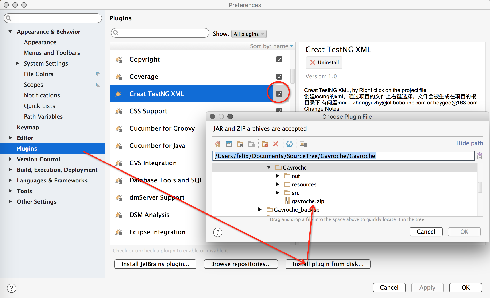
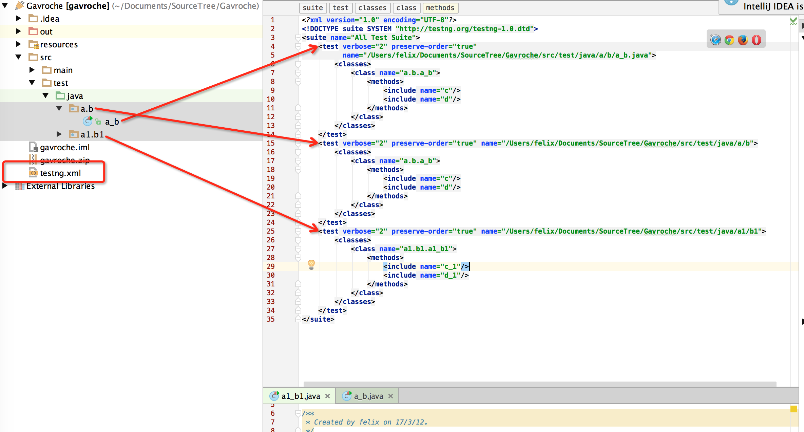
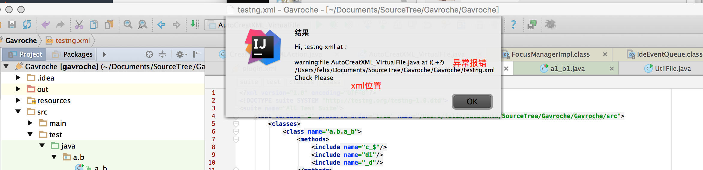
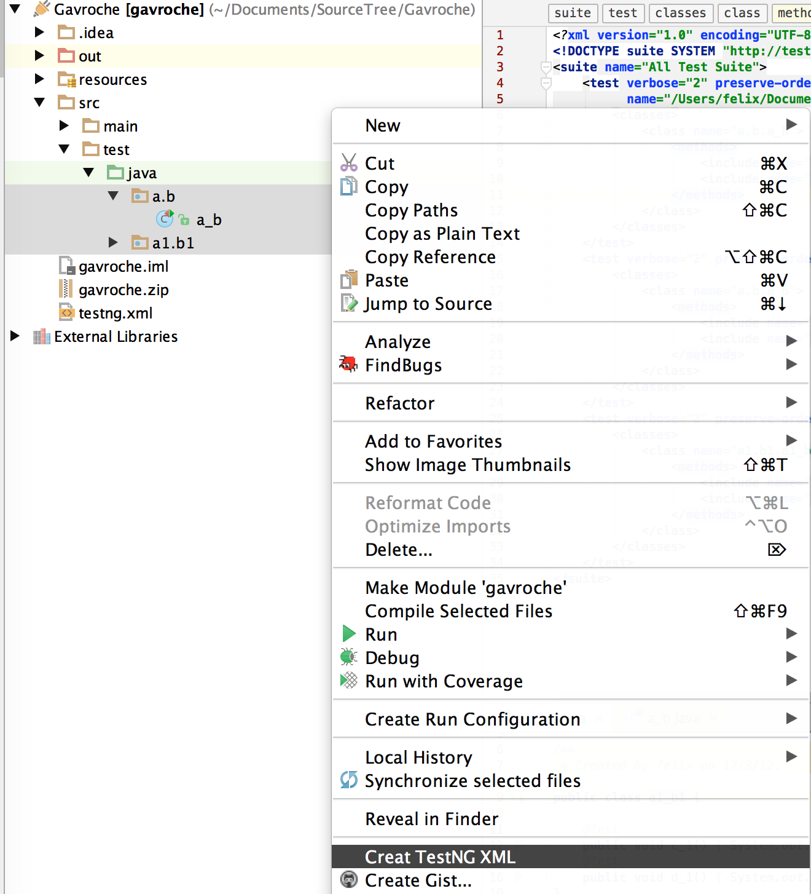

IDEA插件-自动生成testng配置xml|IDEA auto create testng xml|testngXmlAutoCreate
plugins : gavroche.zip

help：

0、安装

1、选择文件 右键选择 Creat TestNG XML

2、结果

3、提示

/*加夫罗契（Gavroche）爱潘妮的亲弟弟*/
第一次学习idea插件制作，有bug感谢反馈

